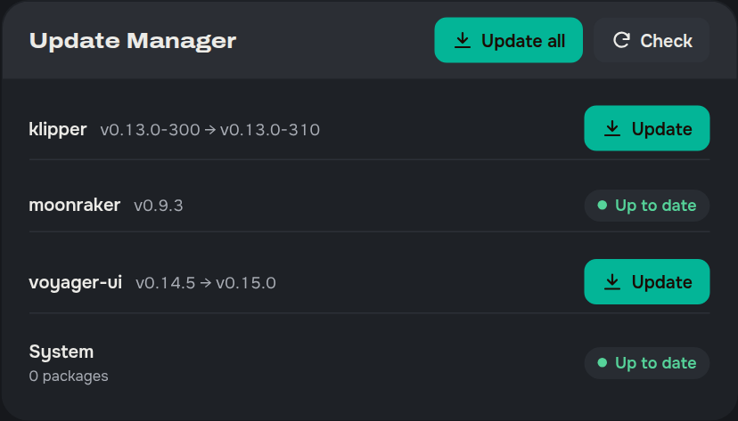

<p align="center"></p>

# Voyager UI

A web interface for Klipper printers. Runs next to Mainsail or Fluidd on its own port, talks to Moonraker like any other client, changes nothing in Klipper.

> **Read this first.** The code in this repo was written with AI (Claude). I am a maker, not a frontend developer, and I could not have built this on my own. I designed it, decided what goes where, tested every feature on my printer, sent back everything that looked or felt wrong and had it redone until it was right. There is a mock Moonraker for automated browser tests, unit tests for the config checks and translations, and the code went through a security review. Still, it is one person's printer and one person's taste. Treat it as early software and keep Mainsail installed next to it.
>
> Why it exists: Mainsail is great but it never quite fit how I use my printer, and reading the forums I saw I am not alone. This is my take on it. If a UI like this is something you wanted too, try it, break it, open an issue.

Tested on: a CoreXY with a Raspberry Pi 4, Klipper + Moonraker installed with KIAUH.

## What it does

A dashboard you arrange yourself (drag, resize, hide, colour the cards), a config editor that understands Klipper and checks your files before you save, and Ctrl+K to reach any page, macro, file or setting by typing a few letters.

Reading is boring. Go click around the **[live demo](https://ozancs.github.io/voyager-ui/)** (a simulated printer running in your browser, nothing is real). If it feels right, install it on your printer and try it there.

Video: coming soon.

## Install

You need Klipper, Moonraker and nginx (they are all there if you have Mainsail or Fluidd) and a free port.

Open a terminal (PowerShell on Windows, Terminal on macOS) and connect to your printer over SSH. Use your printer's user name and IP address, the same ones you use for Mainsail:

```bash
ssh pi@192.168.1.xxx
```

Once you are on the printer, run this and answer the questions:

```bash
curl -fsSL https://raw.githubusercontent.com/ozancs/voyager-ui/main/install.sh | bash
```

Then open `http://<printer-ip>:8000` in your browser. Mainsail or Fluidd stays on port 80 as before.

## Update

The installer registers Voyager UI with Moonraker's update manager, so it shows up next to Klipper and Moonraker. When a new version is out, the sidebar footer says so; click it to go to the Machine page, where the Update Manager card has an Update button on the `voyager-ui` row. It also shows up in Mainsail's and Fluidd's update lists.

<p align="center"></p>

If you prefer, running the install command again also updates.

## Development

```bash
npm install
npm run dev
```

Open `http://localhost:5173/?host=<printer>` to point the dev server at a printer (Moonraker needs the dev address in `cors_domains`). This only works in the dev server, a release build always talks to the host it was loaded from. `npm test` runs the tests, `bash scripts/pack.sh` builds the release zip, pushing a `v*` tag makes a GitHub release. `npm run build:demo` builds the live demo (the UI plus a fake Moonraker in `src/demo/mock.js`), which GitHub Pages serves from every push to main.

## License

GPL-3.0. See [LICENSE](LICENSE).

## For the curious

Everything the UI does, in one list:

- Dashboard with cards you can drag, resize, hide, add and colour. Optional second layout while printing
- Favorites bar for macros and commands
- Temperatures, fans, LEDs, filament sensors and Spoolman in one strip of tiles
- Console, webcam (MJPEG, WebRTC, HLS), heightmap, g-code viewer, file manager, print history, job queue
- Config editor with Klipper syntax colours, search and replace, folding, suggestions, live checks (repeated options, missing includes, unbalanced macro blocks), diff against the saved file or a backup. A backup is made before every save
- Ctrl+K search: pages, macros, files, settings, config options, and quick commands like `bed 60`, `fan 50`, `z offset -0.05`
- Health page: MCU and CAN errors, TMC driver flags, host throttling, maintenance reminders based on print hours
- MMU card for Happy Hare and Box Turtle (AFC)
- Power devices and phone notifications (Telegram, Discord, ntfy, Pushover) through Moonraker
- Dialogs for macro prompts, PROBE_CALIBRATE, BED_SCREWS_ADJUST, SCREWS_TILT_CALCULATE
- Settings dialog like Mainsail's. Printer name, jog steps, extrusion and temperature presets are kept in sync with Mainsail and Fluidd
- Scales to the screen, so a laptop shows the same layout as a big monitor
- 14 languages. Everything except English and Turkish was machine translated, corrections welcome

What the installer does: checks the system first, finds every printer on the host, asks which ones to set up, picks a free port for each, writes an nginx site (webcam ports come from `crowsnest.conf`), checks `trusted_clients` and adds an `[update_manager voyager-ui]` section to `moonraker.conf`. Options:

```
--port 8001              use this port
--printer printer_data_2 only this printer (or: all)
--moonraker-port 7126    if it cannot find it
--check                  only run the system check
--no-updater             skip the update_manager section
--yes                    take every suggested answer
--zip voyager-ui.zip     install from a downloaded release (offline, or to roll back)
--uninstall              remove files, nginx site and update_manager section. Settings stay in the Moonraker database
```

Not supported yet: Creality K1, Sonic Pad and other OpenWrt hosts, Moonraker with `force_logins`.
