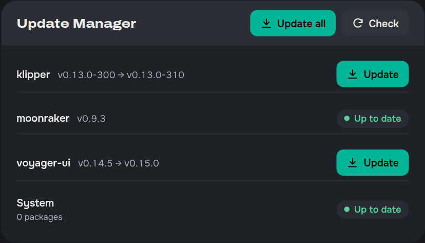

<p align="center"></p>

# Voyager UI

A web interface for Klipper printers. Runs next to Mainsail or Fluidd on its own port, talks to Moonraker like any other client, changes nothing in Klipper.

> **Read this first.** The code in this repo was written with AI (Claude). I am a maker, not a frontend developer, and I could not have built this on my own. I designed it, decided what goes where, tested every feature on my printer, sent back everything that looked or felt wrong and had it redone until it was right. There is a mock Moonraker for automated browser tests, unit tests for the config checks and translations, and the code went through a security review. Still, it is one person's printer and one person's taste. Treat it as early software and keep Mainsail installed next to it.
>
> Why it exists: Mainsail is great but it never quite fit how I use my printer, and reading the forums I saw I am not alone. This is my take on it. If a UI like this is something you wanted too, try it, break it, open an issue.

Tested on: a CoreXY with a Raspberry Pi 4, Klipper + Moonraker installed with KIAUH.

## Live demo

**[Try it in your browser](https://ozancs.github.io/voyager-ui/)**. It is a simulated printer, nothing is real, so click anything. The printer menu next to the name has a few more demo printers.

## What it does

- **Your own dashboard.** Drag, resize, hide and colour the cards. It can switch to a second layout while printing.
- **Checks the file before printing.** Wrong material or not enough filament on the spool (with Spoolman), wrong nozzle size, too hot or too tall: it asks before the print starts.
- **All your printers in one place.** Switch between them, or see all of them on one page with progress and camera.
- **Calibrations in one page.** Input shaper, PID, probe, bed leveling, Shake&Tune and more, with the results shown as plain numbers.
- **Guided calibrations.** PID, leveling, bed screws, probe accuracy, Z offset, bed mesh and input shaper, each on its own, with a picture of what the printer is doing.
- **Errors in plain words.** Common Klipper errors come with the usual cause and what to check.
- **A config editor that knows Klipper.** It checks your files before you save and keeps a history of every version, with what changed and a way back.
- **Health page.** Board connection errors, driver faults, heaters compared with their own earlier behaviour, maintenance reminders.
- **Safer while printing.** Restarts, homing, probing, motors off and mesh changes ask first during a print. A lock button makes a browser read-only, and deletes can be undone for 10 seconds.
- **Ctrl+K.** Type a few letters to reach any page, macro, file or setting.
- **What's new in the UI.** The changelog opens from the version in the footer, and once by itself after an update.
- **14 languages.**

The full list is at the bottom, under For the curious.

Video: coming soon.

## Install

You need Klipper, Moonraker and nginx (they are all there if you have Mainsail or Fluidd) and a free port.

Open a terminal (PowerShell on Windows, Terminal on macOS) and connect to your printer over SSH. Use your printer's user name and IP address, the same ones you use for Mainsail:

```bash
ssh pi@192.168.1.xxx
```

Once you are on the printer, run this and answer the questions:

```bash
curl -fsSL https://raw.githubusercontent.com/ozancs/voyager-ui/main/install.sh | bash
```

Then open `http://<printer-ip>:8000` in your browser. Mainsail or Fluidd stays on port 80 as before.

## Update

The installer registers Voyager UI with Moonraker's update manager, so it shows up next to Klipper and Moonraker. When a new version is out, the sidebar footer says so; click it to go to the Machine page, where the Update Manager card has an Update button on the `voyager-ui` row. It also shows up in Mainsail's and Fluidd's update lists.

<p align="center"></p>

If you prefer, running the install command again also updates.

## Several printers

The arrow next to the printer name in the top bar opens the printer list. Add each printer with a nickname and its address, then switch between them from the same page. The address is the printer's IP or hostname, with a port when Moonraker is not behind a web server on port 80 (Moonraker's own port is usually `7125`). This also covers a Moonraker on a non-standard port.

Each printer has to allow the page's address in `moonraker.conf`, otherwise the browser is not let in:

```ini
[authorization]
cors_domains:
    http://192.168.1.10:8000
```

Use the address you open Voyager UI with. The list is kept in the browser, so every browser has its own list. Dashboard layout and other settings stay on each printer.

With more than one printer in the list, the same menu has All printers: one card per printer with its state, progress, temperatures and a camera snapshot.

## For developers

Building, testing and how the code is laid out: [docs/DEVELOPMENT.md](docs/DEVELOPMENT.md).

## License

GPL-3.0. See [LICENSE](LICENSE). The extra icons in the icon picker come from [Lucide](https://lucide.dev) (ISC, see [LICENSE-lucide](LICENSE-lucide)).

## For the curious

Everything the UI does, in one list:

- Dashboard with cards you can drag, resize, hide, add and colour. Optional second layout while printing
- Favorites bar for macros and commands
- Temperatures, fans, LEDs, filament sensors and Spoolman in one strip of tiles
- Console, webcam (MJPEG, WebRTC, HLS), heightmap, g-code viewer, file manager, print history, job queue
- Config editor with Klipper syntax colours, search and replace, folding, suggestions, live checks (repeated options, missing includes, unbalanced macro blocks), diff against the saved file or a backup. A backup is made before every save, and the History list shows every earlier version of a file (also Klipper's SAVE_CONFIG copies) with the sections that changed
- Ctrl+K search: pages, macros, files, settings, config options, and quick commands like `bed 60`, `fan 50`, `z offset -0.05`
- Calibrations page with a tab for each kind the printer has: input shaper, PID, probe and Z, bed leveling, motors, other calibration macros, and [Klippain Shake&Tune](https://github.com/Frix-x/klippain-shaketune) when installed (run its tests, compare two graphs side by side, write the chosen shaper to your config). On top, guided calibrations: each one opens on its own and is drawn while it runs
- Health page: MCU and CAN errors, TMC driver flags, host throttling, maintenance reminders based on print hours, and heaters compared with their own first measurement (holding power, heat-up time, temperature swing)
- Check before printing: material and remaining weight of the active Spoolman spool, nozzle size, temperatures and height against the printer (only what both sides report is compared)
- Common Klipper errors explained in plain words, under the error banner and behind the ? on console error lines
- MMU card for Happy Hare and Box Turtle (AFC)
- Power devices and phone notifications (Telegram, Discord, ntfy, Pushover) through Moonraker
- Dialogs for macro prompts, PROBE_CALIBRATE, BED_SCREWS_ADJUST, SCREWS_TILT_CALCULATE
- Settings dialog like Mainsail's. Printer name, jog steps, extrusion and temperature presets are kept in sync with Mainsail and Fluidd
- Interface size setting (Auto scales a laptop to the same layout as a big monitor), tablet mode with larger buttons, full screen and the screen kept on
- During a print, commands that would hurt it (restart, SAVE_CONFIG, homing, probing, motors off, bed mesh changes) ask first, also inside macros
- Lock button: this browser can watch but not control the printer, with an optional PIN. E-STOP keeps working
- Deletes of files, history jobs, saved printers and webcams can be undone for 10 seconds
- Webcam can float over the page and stay on screen on every page
- Sounds for each event, browser notifications while the tab is in the background, spoken alerts
- Progress in the browser tab title
- 14 languages. Everything except English and Turkish was machine translated, corrections welcome

What the installer does: checks the system first, finds every printer on the host, asks which ones to set up, picks a free port for each, writes an nginx site (webcam ports come from `crowsnest.conf`), checks `trusted_clients` and adds an `[update_manager voyager-ui]` section to `moonraker.conf`. Options:

```
--port 8001              use this port
--printer printer_data_2 only this printer (or: all)
--moonraker-port 7126    if it cannot find it
--check                  only run the system check
--no-updater             skip the update_manager section
--yes                    take every suggested answer
--zip voyager-ui.zip     install from a downloaded release (offline, or to roll back)
--uninstall              remove files, nginx site and update_manager section. Settings stay in the Moonraker database
```

Moonraker with `force_logins` or an address outside `trusted_clients`: the UI asks for your Moonraker user name and password. This was tested against a simulated Moonraker, not a real one yet, so reports are welcome.

Not supported yet: Creality K1, Sonic Pad and other OpenWrt hosts.
